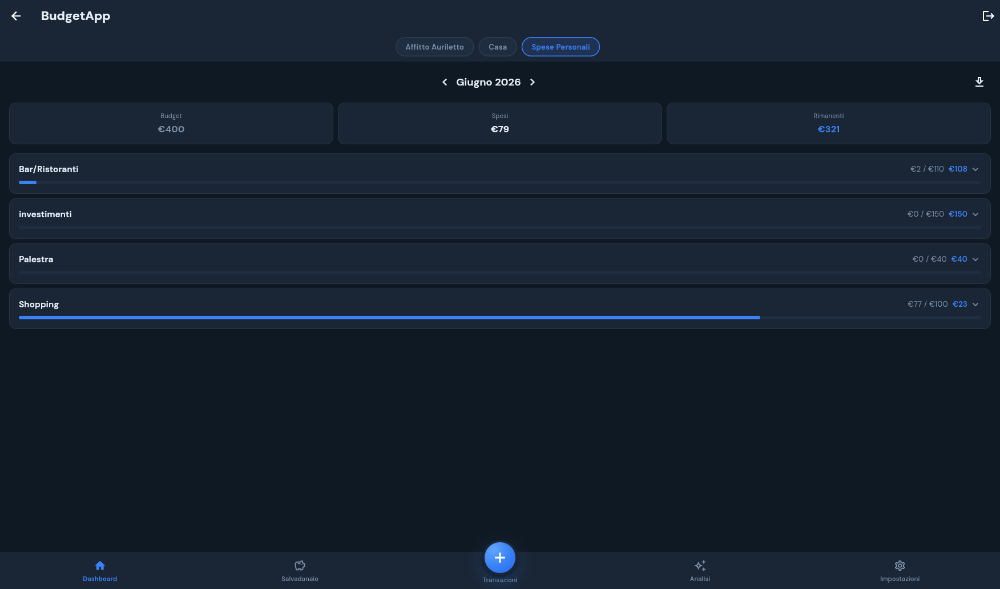
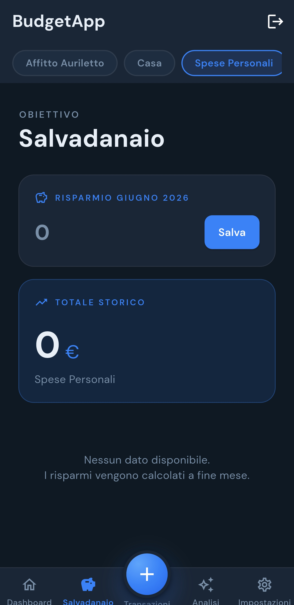
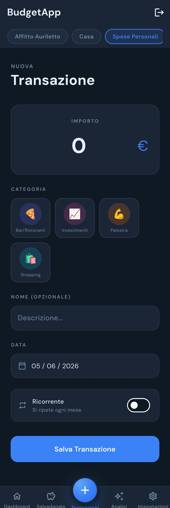
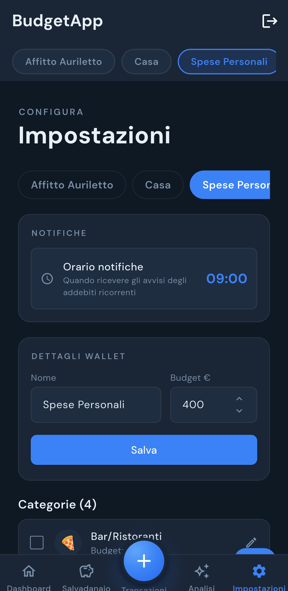

# BudgetApp — Backend (Strapi) & Guida d'installazione completa

App di **gestione budget personale multi-portafoglio**: portafogli con budget mensile,
categorie di spesa, transazioni e un "salvadanaio" che traccia i risparmi mese per mese.

Questo repository contiene il **backend Strapi 5** ed è anche la **guida d'installazione
dell'intero progetto** (backend + web + app Android).

## ✨ Funzionalità

- 💼 **Multi-portafoglio** — più portafogli indipendenti (es. Casa, Affitto, Spese Personali), ognuno con il proprio budget mensile e selezione rapida.
- 📊 **Dashboard mensile** — per ogni categoria vedi *Budget / Speso / Rimanente* con barra di avanzamento; navighi tra i mesi; i valori sforati diventano rossi; espandi una categoria per vederne le transazioni.
- 🏷️ **Categorie con budget e icone** — ogni categoria ha budget mensile, icona e ricorrenza.
- ➕ **Transazioni rapide** — importo, categoria, data, descrizione opzionale e toggle *ricorrente* (si ripete ogni mese).
- 🐷 **Salvadanaio** — traccia i risparmi mese per mese (`budget − speso`) con totale storico; snapshot mensile automatico via cron Strapi.
- 🤖 **Analisi estratto conto** — carichi il PDF (o CSV) della banca e viene confrontato con le transazioni registrate: sforamenti, movimenti mancanti e un giudizio sintetico. I movimenti si leggono con un parser esatto quando il formato è riconosciuto, altrimenti ci pensa un LLM. Vedi [Estratti conto e banche](#-estratti-conto-e-banche).
- 🔔 **Notifiche** — promemoria degli addebiti ricorrenti a un orario configurabile.
- ⚙️ **Impostazioni** — gestisci portafogli (nome, budget) e categorie (crea, modifica, elimina anche in multi-selezione).
- 📤 **Export CSV** dei dati.
- 🔐 **Autenticazione JWT** — login sicuro, multi-dispositivo.
- 🌙 **UI dark, stile banking moderno.**

## 📸 Screenshot

| Dashboard | Salvadanaio | Nuova transazione |
|---|---|---|
|  |  |  |

| Analisi estratto conto (AI) | Impostazioni |
|---|---|
|  |  |

## 🏗️ Architettura

Il progetto è diviso in **tre repository**:

| Repo | Cosa | Stack |
|---|---|---|
| **budget-api** (questo) | Backend / API REST | Strapi 5 + MySQL |
| [budget-app](https://github.com/v3zz0/budget-app) | Frontend web | Vue 3 + Vite + PrimeVue |
| [budget-flutter](https://github.com/v3zz0/budget-flutter) | App Android nativa | Flutter |

Web e mobile consumano **le stesse API REST** esposte da questo backend.

### Modello dati

- **Wallet** → più **Categories** (one-to-many)
- **Category** → più **Transactions** (one-to-many)
- **Salvadanaio** → snapshot mensili per wallet (`risparmio = budget_allocato − speso`, se positivo)

---

## ✅ Prerequisiti

- **Node.js** `>= 20 <= 24` ([nvm](https://github.com/nvm-sh/nvm) consigliato)
- **MySQL** `8.x` (o MariaDB 11.x) in ascolto e raggiungibile
- **npm** `>= 6`
- (Opzionale) **Docker** + Docker Compose per il deploy
- (Opzionale) **Ollama** in locale per la feature "analisi estratto conto" via LLM

---

## 🚀 Installazione backend (sviluppo)

```bash
# 1. Clona il repo
git clone https://github.com/v3zz0/budget-api.git
cd budget-api

# 2. Installa le dipendenze
npm install

# 3. Crea il file di ambiente dai placeholder
cp .env.example .env

# 4. Genera segreti REALI e compilali nel .env (vedi sotto)
openssl rand -base64 16   # ripeti per ogni segreto

# 5. Prepara il database MySQL (una tantum)
#    mysql -u root -p -e "CREATE DATABASE budget CHARACTER SET utf8mb4;"

# 6. Avvia in sviluppo (hot reload + admin panel)
npm run develop
```

Admin panel: **http://localhost:1337/admin** (al primo avvio crei l'utente amministratore).
API REST: **http://localhost:1337/api**

---

## 🔑 Permessi (passaggio obbligatorio)

Strapi crea le tabelle da solo al primo avvio, ma **tiene tutte le API chiuse**.
Finché non abiliti i permessi, l'app risponde `403 Forbidden` a ogni chiamata,
senza spiegare il motivo. È il primo scoglio di chiunque clona il progetto.

Nel pannello admin: **Settings → Users & Permissions plugin → Roles → Authenticated**,
poi spunta queste voci e premi **Save**:

| Sezione | Voci da abilitare |
|---|---|
| **Wallet** | `find`, `findOne`, `create`, `update`, `delete` |
| **Categorie** | `find`, `findOne`, `create`, `update`, `delete` |
| **Transazioni** | `find`, `findOne`, `create`, `update`, `delete` |
| **Salvadanaio** | `find`, `findOne`, `create`, `update`, `delete` |
| **Analisi** | `analizza`, `testAi` |
| **Consiglio** | `find`, `findOne`, `applica`, `segna` |
| **Users-permissions → User** | `me`, `update` |

Il ruolo **Public** non serve: tutte le rotte richiedono un utente autenticato.

> I controller filtrano comunque per utente: ognuno vede solo i wallet propri e
> ciò che vi appartiene. Abilitare i permessi non espone i dati altrui.

### Creare il primo utente dell'app

L'utente dell'admin panel **non** è un utente dell'app. Registra il tuo dalla
schermata di login dell'app, oppure via API:

```bash
curl -X POST http://localhost:1337/api/auth/local/register \
  -H 'Content-Type: application/json' \
  -d '{"username":"mario","email":"mario@esempio.it","password":"unaPasswordSolida"}'
```

### Variabili d'ambiente (`.env`)

Copiate da `.env.example`. **Nessun valore va committato** (`.env` è in `.gitignore`).

| Variabile | Descrizione |
|---|---|
| `HOST` / `PORT` | Bind del server (default `0.0.0.0:1337`) |
| `APP_KEYS` | Chiavi di sessione (lista separata da virgole) |
| `API_TOKEN_SALT`, `TRANSFER_TOKEN_SALT` | Salt per i token |
| `JWT_SECRET`, `ADMIN_JWT_SECRET` | Firma dei JWT (API e admin) |
| `ENCRYPTION_KEY` | Cifratura dei dati Strapi |
| `DATABASE_*` | Client, host, porta, nome, utente, password del DB |
| `OLLAMA_URL`, `OLLAMA_MODEL` | (Opzionale) endpoint e modello per l'analisi estratto conto |
| `AI_TIMEOUT_MS` | (Opzionale) quanto aspettare una risposta del modello, default `60000` |
| `AI_MAX_BLOCCHI` | (Opzionale) blocchi di testo per documento senza parser dedicato, default `6` |

> ⚠️ **Genera segreti nuovi e casuali** (es. `openssl rand -base64 16`). Non riusare mai
> valori d'esempio o presi da altri deploy.

### Se l'analisi va in timeout (504)

Un `504 Gateway Time-out` non arriva da Strapi ma dal reverse proxy davanti
(nginx/openresty), che chiude la connessione prima che l'analisi finisca.
L'analisi è sincrona e con un modello lento può durare minuti.

Tre leve, in ordine di efficacia:

1. **Usa un modello non "reasoning".** Quelli che ragionano prima di rispondere
   (`qwen3`, `deepseek-r1`, `o1`…) impiegano molto più tempo e il ragionamento
   noi lo buttiamo via. Per questo compito vanno benissimo modelli normali tipo
   `qwen2.5-7b-instruct` o `llama-3.1-8b-instruct`.
2. **Alza il timeout del reverse proxy.** Il default di nginx è 60s:

   ```nginx
   location /api/analisi- {
       proxy_pass http://strapi:1337;
       proxy_read_timeout 300s;
       proxy_send_timeout 300s;
   }
   ```

3. **Scrivi un parser per la tua banca.** È la soluzione vera: l'estrazione
   diventa istantanea e il modello serve solo per le rifiniture. Vedi
   [Scrivere il parser della tua banca](#scrivere-il-parser-della-tua-banca).

Il server comunque non resta più appeso: superato `AI_TIMEOUT_MS` la chiamata
viene abortita, e i passi opzionali (categorie suggerite e giudizio) vengono
saltati con un avviso nel report invece di far fallire tutta l'analisi.

---

## 🐳 Deploy con Docker

Il repo include `Dockerfile` e `docker-compose.yml`. **I segreti NON sono nell'immagine**:
vengono iniettati a runtime dal file `.env` (che resta fuori dal versionamento).

```bash
# Assicurati di aver compilato .env (vedi sopra)
docker compose up -d --build
```

- Il container legge tutte le variabili da `.env` (`env_file` nel compose).
- Gli upload vengono persistiti in `./data/uploads`.
- Per usare un registry tuo, modifica `image:` nel compose e lo script `pushDocker.sh`
  (l'host `registry.example.com` è un placeholder da sostituire).

---

## 🖥️ Frontend web — [budget-app](https://github.com/v3zz0/budget-app)

```bash
git clone https://github.com/v3zz0/budget-app.git
cd budget-app
npm install
cp .env.example .env   # imposta VITE_API_URL sull'URL del backend
npm run dev            # http://localhost:5173
```

Dettagli nel [README di budget-app](https://github.com/v3zz0/budget-app).

---

## 📱 App Android — [budget-flutter](https://github.com/v3zz0/budget-flutter)

```bash
git clone https://github.com/v3zz0/budget-flutter.git
cd budget-flutter
flutter pub get
flutter build apk --release --split-per-abi
```

**L'indirizzo del backend si inserisce nell'app**, nel campo *Server* della
schermata di login: non serve ricompilare per puntare al proprio Strapi.
Resta salvato sul telefono e si può cambiare quando si vuole.

In sviluppo puoi comunque precompilarlo:

```bash
flutter run --dart-define=API_BASE_URL=http://10.0.2.2:1337   # emulatore Android
```

Per distribuire un APK serve una chiave di firma tua: vedi
`android/key.properties.example` nel repo dell'app. Senza, la release viene
firmata con la chiave di debug (va bene per provare, non per distribuire).

Guida build APK completa nel [README di budget-flutter](https://github.com/v3zz0/budget-flutter).

---

## 🏦 Estratti conto e banche

L'analisi legge i movimenti in due modi, nell'ordine:

1. **Parser esatto.** Se il documento ha un formato riconosciuto, i movimenti si
   estraggono con una regex: istantaneo, ripetibile, nessun rischio che una riga
   venga saltata o inventata. Oggi c'è
   [`sella-parser.js`](src/api/analisi/services/sella-parser.js) per Banca Sella
   (PDF ed export CSV).
2. **LLM di riserva.** Se nessun parser riconosce il documento, il testo va al
   modello configurato (Ollama o un servizio compatibile OpenAI, es. OpenRouter).
   Funziona con qualsiasi banca, ma è lento e può sbagliare: verifica sempre i
   risultati.

Nel report il campo `fonte` dice quale strada è stata usata
(`sella-parser`, `llm`, o entrambe se hai caricato più documenti).

### Scrivere il parser della tua banca

Il modo migliore per contribuire. Serve un file che esponga `parse(testo)` e
restituisca un array di `{ data: 'YYYY-MM-DD', importo, descrizione }` con i soli
addebiti (importo positivo). `sella-parser.js` è il modello da copiare: 70 righe.

Due accorgimenti che fanno la differenza:

- **Pretendi i due decimali nell'importo** (`,dd`): scarta da solo numeri di
  conto, date e conteggi che altrimenti verrebbero letti come cifre.
- **Verifica il totale.** Se l'estratto stampa un totale, controlla che la somma
  dei movimenti estratti coincida: è la prova che non ne hai persi.

Il motore AI si sceglie dall'app in **Impostazioni → Analisi AI** (indirizzo,
modello e chiave API); i valori in `.env` restano il default.

---

## 🔒 Sicurezza

- `.env`, `*.sql` e i dump dati **non vanno mai committati** (già in `.gitignore`).
- Se cloni per deploy, **genera segreti tuoi** e usa una password DB forte.
- CORS: per far dialogare web/mobile col backend, configura le origini consentite
  in `config/middlewares.js` (`strapi::cors` → `origin`).

## 📄 Licenza

Progetto personale. Usa/adatta liberamente.
